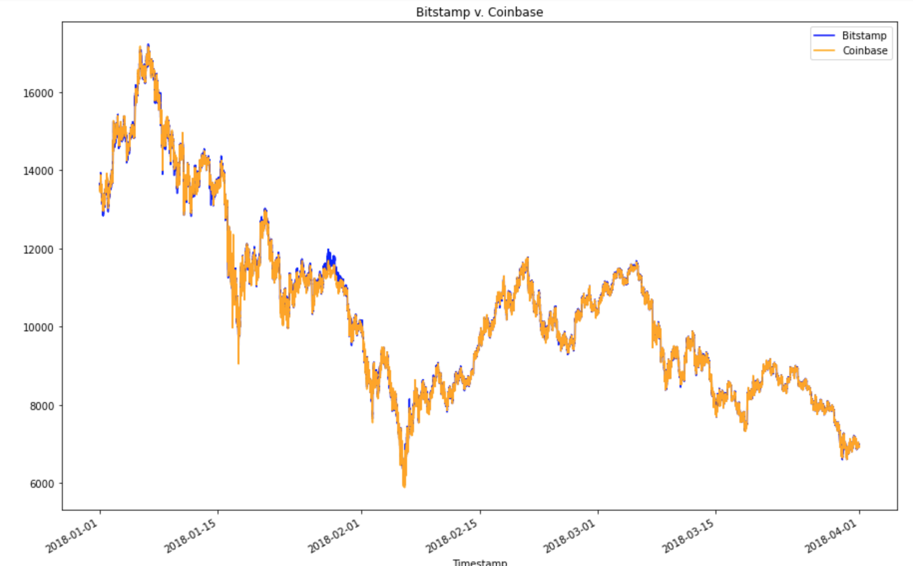
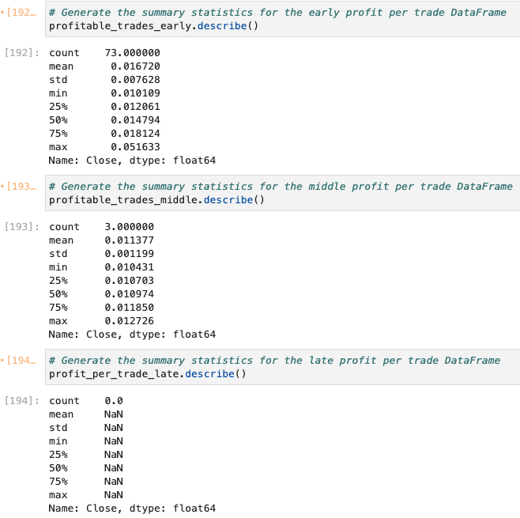
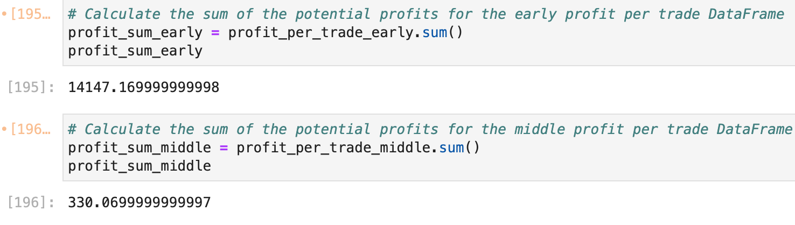

# Crypto Arbitrage

>As Bitcoin trades on exchanges all over the world, one may capitalize on simultaneous price dislocations in different markets. This Jupyter notebook file displays the analysis and final report of potential arbitrage opportunities in Bitcoin through historical trade data on two exchanges: Bitstamp and Coinbase. 

Three phases of financial analysis are included in the file to determine if any arbitrage opportunities exist for Bitcoin.
    
* Data collection

* Data preparation

* Data analyzation
---

## Technologies
This project leverages python 3.7 with the following packages:

* [pandas](https://pandas.pydata.org/docs/getting_started/overview.html) - To read, calculate, analysis, visualize data

* [pathlib](https://docs.python.org/3/library/pathlib.html) - For providing paths of files and directories

---

## Installation Guide

Before running the Jupyter notebook file, first, install the following dependencies in Terminal or Bash.

```python
  pip install pandas
  pip install pathlib
```

---

## General Information

Trading data were process with Pandas library from a CSV file to two separate DataFrames - Bitstamp and Coinbase from 2018-01-01 to 2018-04-01. Based on financial analysis, potential arbitrage opportunities exist. Accross the entire analyzing period, profit information displays the following trend: arbitrage profits are higher during earlier dates of the total analyzed 3-month-period, and arbitrage oppotunities appear more frequent in the earlier dates of the total analyzed period. 

From the Bitstamp v. Coinbase overlay graph below we can see that there are arbitrage oppotunities based on the distinct color differences btween the two.



In order to generate data visualization and deliver a more specific analysis, three dates were selected to represent data from the early days (Jan. 16, 2018), middle days (Feb. 24, 2018), and late days (Mar. 26, 2018) of the study period. By calculating profitable arbitrage trades for the early date with 

`profitable_trades_early = spread_return_early[spread_return_early > .01] ` 

and use similar functions to calculate the middle and late date. The statistics summary of the calculation indicates that the early date of the period has the most profitable arbitrage trading opportunities with 73 times. While the middle date has 3 and late date has none. 



Furthermore, the profit per trade for the early date is calculated by using 

`profit_early = profitable_trades_early * bitstamp['Close'].loc['2018-01-16']` 

and then for the middle date using a similar function. The results of total profit for both early and middle date below show an obvious advantage of trading in the early days of the period as it returns $13,817.10 more total profit in the early trading date.



In conclusion, the analysis of Bitstamp and Coinbase trading data shows potential arbitrage opportunities exist especially in the early days of the period and early days tend to generate higher profits.

---

## Contributors

**UC Berkeley Extension**

**Yanjun Lin Andrie**

* yanjun.lin.andrie@gmail.com

* https://www.linkedin.com/in/yanjun-linked

---

## License

MIT
